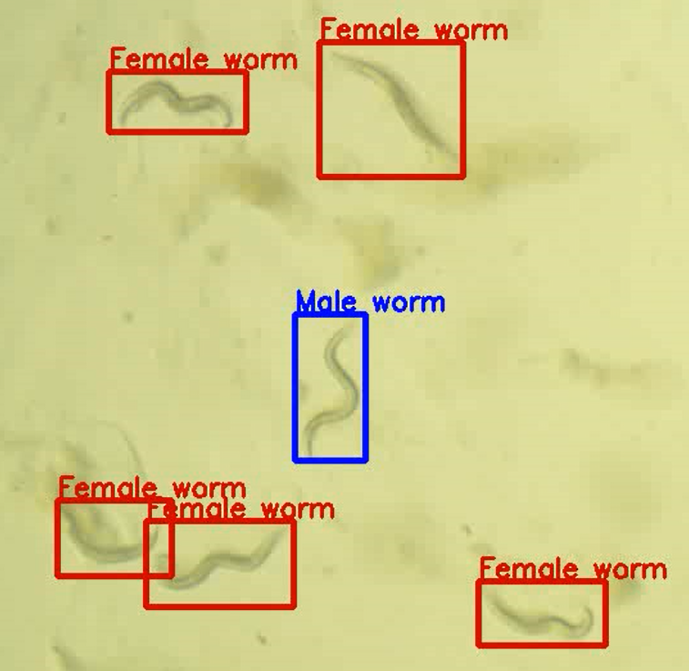

<div id="header" align="center">
  <h1>
    Worm tracker with OpenCV
    
  </h1>

</div>
This project aims to track male and female C. elegan worms using OpenCV tracking algorithms only.

## Dependencies

To run this project, you need to install the following dependency:

- `opencv`
- `Numpy`
- `Scikit-Image`

Advisable to install open-cv using the following command:

```pip install opencv-contrib-python```


## How to Use
1. Clone the repository using the command: `git clone <repo_url>`
2. Navigate to the project directory: `cd <repo>`

#### For main.py
3. Edit the path to the input worm video in the `main.py` script.
4. Run the script using the command: `python main.py`
5. Once the script is executed, an image will appear where you need to draw bounding boxes around the worms. The first bounding box should be for the male worm, while subsequent boxes are for female worms.

#### For segmentation.py
3. Follow step 3 in `main.py` section above and run the script using command `python segmentation.py`
4. Once the script is ran, a gray scale image will appear asking if the segmentation performed on the image is okay.
5. Hit any key and on the terminal, you will be asked if you wish to adjust the parameters to make the segmentation better.
6. When you are done tuning the segmentation parameters, you will then follow step 5 in the `main.py` section above.

### Drawing Multiple Bounding Boxes

To draw multiple bounding boxes, follow these steps:

1. After drawing a bounding box for a worm, press the 'Enter' key twice to draw another bounding box.
2. After drawing the final bounding box, press the 'Enter' key and then 'q'.

After this, the script will display the output frames of the video with the tracked worms. If you want to end the script/video, press 'q'. The output video will be saved as 'worm_tracker.mp4'.

## Results and Areas of concern
Multiple OpenCV tracking algorithms where used such as the Tracking-Learning-Detector (TLD), Kernelized Correlation Filters (KCF), and Channel and Spatial Reliability Tracking (CSRT).

Image segmentation was later performed which boosted detection accuracy. Check `results` folder for videos.


