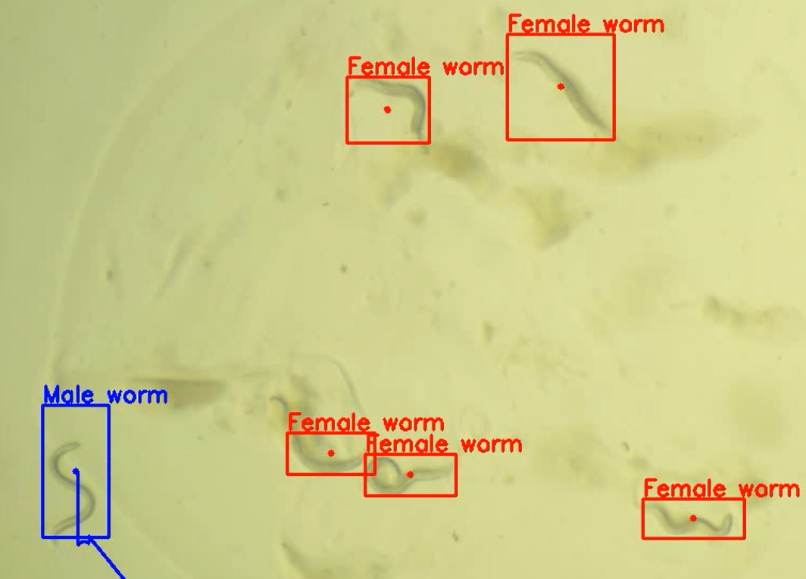

# Worm Tracker with OpenCV

This project aims to track male and female C. elegan worms using OpenCV tracking algorithms only.

## Dependencies

To run this project, you need to install the following dependency:

- `opencv-contrib-python`

You can install it using the following command:

```pip install opencv-contrib-python```


## How to Use

1. Clone the repository using the command: `git clone <repo_url>`
2. Navigate to the project directory: `cd <repo>`
3. Edit the path to the input worm video in the `main.py` script.
4. Run the script using the command: `python main.py`
5. Once the script is executed, an image will appear where you need to draw bounding boxes around the worms. The first bounding box should be for the male worm, while subsequent boxes are for female worms.

### Drawing Multiple Bounding Boxes

To draw multiple bounding boxes, follow these steps:

1. After drawing a bounding box for a worm, press the 'Enter' key twice to draw another bounding box.
2. If you no longer wish to draw bounding boxes, press the 'Enter' key and then 'q'.

After this, the script will display the output frames of the video with the tracked worms. If you want to end the script/video, press 'q'. The output video will be saved as 'worm_tracker.mp4'.

## Results and Areas of concern
Multiple OpenCV tracking algorithms where used such as the Tracking-Learning-Detector (TLD), Kernelized Correlation Filters (KCF), and Channel and Spatial Reliability Tracking (CSRT). CSRT had the best performance and the results are shown below.
* [](results/worm_tracker2.mp4)
* [](results/worm_tracker3.mp4)
As seen in the videos above, the tracking algorithm is efficient at the start of both videos but as the male worm moves, the tracking algorithm begins to falter. To improve on this, a detection algorithm can be used at interval to detect the worms after the tracker looses track.


